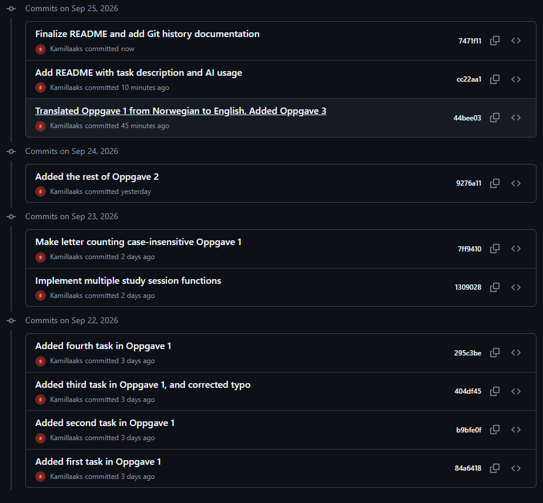

# Arbeidskrav 1 - Python
Navn: Kamilla Selnes

Programmene er skrevet i Python og kan kjøres fra innleveringsmappen.

Eksempel: 
python oppgave-1.py

De øvrige oppgavene kjøres på samme måte ved å endre filnavnet.

## Kjente feil og mangler
Jeg har ikke rukkert å fullføre allle oppgavene. Oppgave 3 er delvis påbegynt, men ikke ferdig. Oppgave 4 og 5 er ikke
påbegynt.

Jeg har heller ikke rukket å spille inn videoen som skal følge med innleveringen.

## Oppgave 1
Løsning og fremgangsmåte:
Jeg har delt opp oppgaven i flere funksjoner, og har lagd en meny der brukeren kan velge
hvilken del av programmet som skal kjøres. Jeg valgte å bruke parametere i funksjonene for å få mer trening i dette
siden det er noe jeg tidligere har syns har vært utfordrende og vanskelig å forstå.

Underveis jobbet jeg med å få menyen til å kalle riktig funksjon basert på brukerens valg. Jeg måtte blant annet rette
en feil som oppstod fordi input() returnerer tekst, mens menyvalgene mine ble sammenlignet med heltall.

Bruk av KI i oppgaven:
Jeg valgte å bruke ChatGPT til læringsstøtte for å forstå oppgaveteksten og diskutere funksjoner, parametere og validering
av brukerinput. Jeg brukte det blant annet til å finne relevante kilder og dokumentasjon som jeg kunne lese for å forstå
hvordan jeg skulle løse oppgaven. Jeg brukte også ChatGPT til feilsøking av menyen, der jeg fikk hjelp til å oppdage at 
jeg hadde glemt å konvertere brukerens menyvalg til et heltall med int().

## Oppgave 2
Løsning og fremgangsmåte:
Jeg valgte å bruke en liste med dictionaries for å lagre studieøktene. Hver dictionary representerer en studieøkt, og de 
inneholder tema, varighet i minutter og status.

Jeg valgte denne løsningen fordi hver studieøkt har flere opplysninger som hører sammen. Ved å bruke dictionaries, så
kunne jeg gi opplysningene tydelige nøkler, som topic, duration_minutes og status, i stedet for å være avhengig av 
plasseringen deres i en liste.

Siden alt var samlet i en liste, kunne jeg enkelt legge til nye økter, og gå gjennom dem for å filtrere, søke, sortere 
og beregne samlet studietid. Det gjorde det også mulig å registrere flere økter uten at man måtte opprette egne variabler
for hver av dem.

Bruk av KI i oppgaven:
Jeg valgte å bruke ChatGPT til læringsstøtte og for å finne relevante og gode kilder i denne oppgaven også. Blant annet
brukte jeg den til å diskutere søkefunksjonen, og hvordan man kunne håndtere tilfeller der søket ikke ga noen treff. Jeg 
fikk også forklaringer på any() og str(). Jeg har skrevet og testet koden selv. 

## Oppgave 3
Løsning og fremgangsmåte:
Denne oppgaven rakk jeg ikke å bli ferdig med. Men jeg startet med å dele oppgaven i fire funksjoner, og ga de hvert 
sitt ansvarsområde. Den ene skal konvertere dato, en skal beregne sluttidspunkt, en skal beregne antall dager mellom to 
datoer, og den siste skal sortere datoer kronologisk.

Jeg opprettet først funksjonene med midlertidige print() -uttrykk for å få på plass strukturen før jeg skulle begynne å
implementere funksjonaliteten.

Jeg valgte å undersøke Pythons datetime-bibliotek, siden det inneholder funksjonalitet for å jobbe med datoer, klokkeslett
og tidsintervaller.

Tester:
| Test | Input | Forventet resultat | Faktisk resultat |
|---|---|---|---|
| 1 | 01.01.2026 | Gyldig dato | Returnerte 2026.01.01 |
| 2 | 31.02.2026 | Ugyldig dato | Viste feilmelding og ba om ny dato |

Bruk av KI i oppgaven:
Jeg brukte ChatGPT til å finne relevant informasjon og dokumentasjon om Pythons standardbibliotek, spesielt datetime. Jeg
har også brukt ChatGPT til å få forklart hvordan datostrenger kan konverteres til datoverdier, og til å diskutere hvordan
funksjoner kan ta imot parametere og returnere verdier til hovedprogrammet.

Jeg brukte informasjonen som læringsstøtte i mens jeg jobbet med min egen løsning.

Kilder og dokumentasjon:
Jeg brukte den offisielle Python-dokumentasjonen for å lære hvordan man kan jobbe med datoer, klokkeslett og tidsintervaller
ved hjelp av datetime

Tittel: Datetime - Basic date and time types
Kilde: Python Software Foundation
Nettadresse: https://docs.python.org/3/library/datetime.html

## Git-historikk
Jeg har brukt Git under arbeidet med oppgavene.
Commit-historikken er tilgjengelig på Github:

[Se Git-historikken]https://github.com/Kamillaaks/ga-emne1-arbeidskrav1/commits/master/
